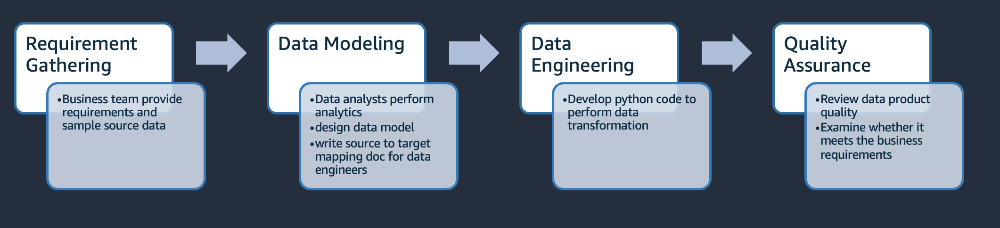

# Data Engineering Agents 
Large enterprises often face the issue with data silos. Large amount of siloed data can hardly drive business value. Although GenAI is popular, if the foundamental data silo problems are not solved, it is hard for GenAI to truely deliver value. 

Data product development is a complex, multi-team effort that often spans several quarters. Even developing a Minimum Viable Product (MVP) to prove business value often requires multiple months. 

This repo presents a data product development agent that have specialty agents collaboratively deliver data products automatically. * Note that the QA agent is still WIP so not included in this release. 


The data product agent can reduce months of data product development work down to under an hour, largely reduce the cost of building connected data that can drive business decisions. 

## Get Started: 

1. **Install `uv`**

    ```{.bash}
    curl -LsSf https://astral.sh/uv/install.sh | sh
    export PATH="$HOME/.local/bin:$PATH"
    uv venv && source .venv/bin/activate && uv pip sync pyproject.toml
    UV_PROJECT_ENVIRONMENT=.venv
    uv add zmq
    python -m ipykernel install --user --name=.venv --display-name="Python (uv env)"
    ```
2. Edit the `config.json` file by putting in your use case information 
3. launch jupyter lab
    ```{bash}
    uv run --with jupyter jupyter lab
    ```
4. run jupyter notebook at`src/data_product_strands_agents.ipynb`

The generated data model, code and data products will be saved in the location you put in the config.json file. You can monitor the progress in the jupyter notebook. 


## Security

See [CONTRIBUTING](CONTRIBUTING.md#security-issue-notifications) for more information.

## License

This library is licensed under the MIT-0 License. See the LICENSE file.
